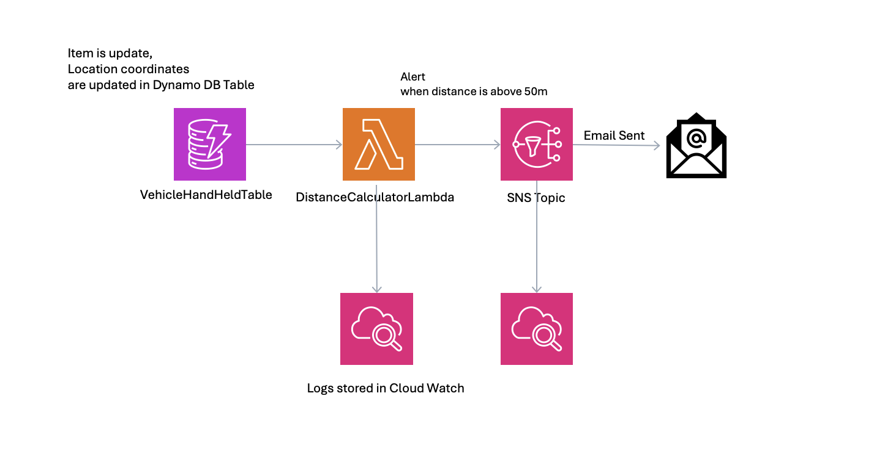

# PostNL Assignment
This repo is created to submit the assignment for the Senior Cloud Engineer at PostNL.

### Tech stack used

* AWS Cloud
* AWS SDK for creation of few resources (SQS, IAMRole)
* Terraform for Lambda
* Lambda code written in Python Language
* GitHub Actions for automated infra deployment


## Architecture of basic application:



### Test Payload for the Lambda

**Case 1:** Distance of Vehicle and HandHeld Device is 50m or apart.

```
 {
  "vehicle_lat": 52.3676,
  "vehicle_lon": 4.9041,
  "handheld_lat": 52.3681,
  "handheld_lon": 4.9055,
  "vehicle_mac": "00:1A:2B:3C:4D:5E",
  "handheld_mac": "00:1A:2B:3C:4D:5F"
}
```

**Case 2:** Distance of Vehicle and HandHeld Device is less than 50m or apart.

```
 {
  "vehicle_lat": 52.3679,
  "vehicle_lon": 4.9045,
  "handheld_lat": 52.3677,
  "handheld_lon": 4.9043,
  "vehicle_mac": "00:1A:AS:3C:4D:5E",
  "handheld_mac": "00:1A:SE:42:3V:5F"
}
```